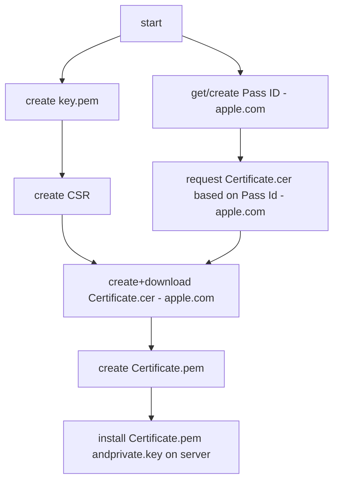

# Apple Passport Server

## Cert stuff

To run the passbook server you need a certificate and a private key. The certificate is used to sign the passbook files and the private key is used to sign the push notifications. The certificate and the private key are stored in the config file of the passbook server.



### prepare key and CSR for requesting a certificate from apple

- create your own private key
```shell
$ openssl genrsa -out key.pem 2048
```

- create a certificate signing request (CSR) with the private key
```shell
$ openssl req -new -key key.pem -out request.csr -subj="/emailAddress=[your email addr],CN=[your full name],C=[your country ISO code]"
```


### Get a Pass Type Id and certificate from Apple

you need a developer account at apple to get a pass type id and a certificate for signing your passes. you can get a free developer account at [developer.apple.com](https://developer.apple.com/programs/)

* Visit the iOS Provisioning [Portal -> Pass Type IDs -> New Pass Type ID](https://developer.apple.com/account/resources/identifiers/list/passTypeId)
* Select pass type id -> Configure (Follow steps and download generated pass.cer file)
* Use Keychain tool to export a Certificates.cer  file (need Apple Root Certificate installed)
* Convert the certificate.cer (X509 format) to a certificate.pem file by calling

```shell
    $ openssl x509 -inform der -in pass.cer -out certificate.pem
```

### Install certificate and private key on your server

copy the certificate.pem and the key.pem to your server and install it in the right place. the path to the certificate and the key is defined in the config file of the passbook server.

